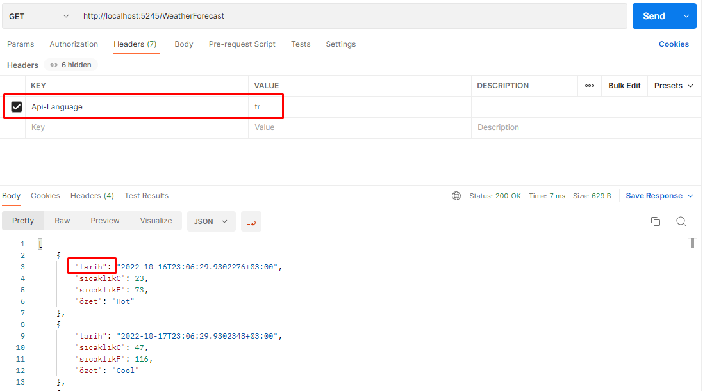
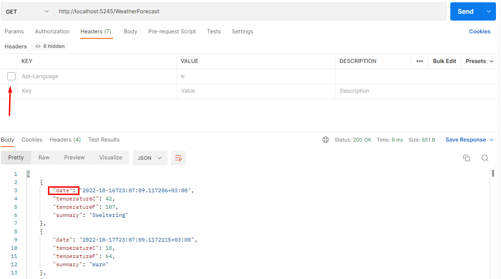

# Api Dili
Birçok yazılımcı, api içeriğinin dilini nasıl değiştireceğini bilir.<br/>
Fakat, api alanlarını değiştirmek zor olabilir.<br/>
Tabiki dto ve automapper benzeri yöntemler ile çözüm bulabilirsiniz.<br/>
<br/>
Bu kaynak, api alanlarını çevirmede yardımcı olabilir.<br/>
Örneğin:<br/>

İngilizceden<br/>
```
{
    "name":"Name"
}
```
Türkçeye<br/>

```
{
    "ad":"Name"
}
```
## Özellikler

- Api alanlarını değiştirebilirsiniz
- .Net 6
- Başka paketlere bağımlılık yok
- Middleware
- header 
- Açık kaynak, ücretsiz


## Kurulum

Api kodunuzu yazın<br/>
Languages.cs kopyalayın, kendi alanlarınıza göre değiştirin.<br/>
LocalizationMiddleware.cs kopyalayın, bir değişiklik yapmanıza gerek yok.<br/>
<br/>
program.cs içinde<br/>
Eğer bütün api metodlarınızda geçerli olmasını istiyorsanız, bu kullanın<br/>
```
    app.UseMiddleware<LocalizationMiddleware>();
```
Eğer bazı özel api metodlarınızda geçerli olmasını istiyorsanız, bu kullanın<br/>
```
app.UseWhen(context => context.Request.Path.StartsWithSegments("/WeatherForecast"), appBuilder =>
{
    appBuilder.UseMiddleware<LocalizationMiddleware>();
});
```
api header değer atayın<br/>
```
--header 'Api-Language: de'
```
Maalesef, swagger'ı kolayca kullanamazsınız, Postman kullanın.<br/>

## Uyarılar
- servisiniz daha az performansta çalışır
- Eski sürüm .Net desteklemez
- header gereklidir

# Ekran Görüntüleri
## Almanca


## Türkçe


## Default


***

# Api Language


Most of developers knows, how to change content language.<br/>
But, changing api fields may be difficult.<br/>
Of course, you can use dto and automapper etc.<br/>
<br/>
This github repository helps to translate api fields.<br/>
For example:<br/>
from (english)<br/>
```
{
    "name":"Name"
}
```
to (türkçe)<br/>

```
{
    "ad":"Name"
}
```
## Features

- You can change api fields language 
- .Net 6
- No Dependency
- Middleware
- header 
- Public, open source, feel free to use


## Installation & Using

Write your api code.<br/>
Copy Languages.cs, modify your language,your fields.<br/>
Copy LocalizationMiddleware.cs, don't change any thing.<br/>
<br/>
in program.cs<br/>
if you want to apply to all api, use this<br/>
```
    app.UseMiddleware<LocalizationMiddleware>();
```
if you want to apply to special (named) api, use this<br/>
```
app.UseWhen(context => context.Request.Path.StartsWithSegments("/WeatherForecast"), appBuilder =>
{
    appBuilder.UseMiddleware<LocalizationMiddleware>();
});
```
Set api header<br/>
```
--header 'Api-Language: de'
```
Unfortunately, you can't use with swagger easyly, use Postman<br/>

## Warnings
- less performance
- Don't support earlier .Net (<.Net 5)
- header needed

# Screen Shots
## German


## Türkçe


## Default
